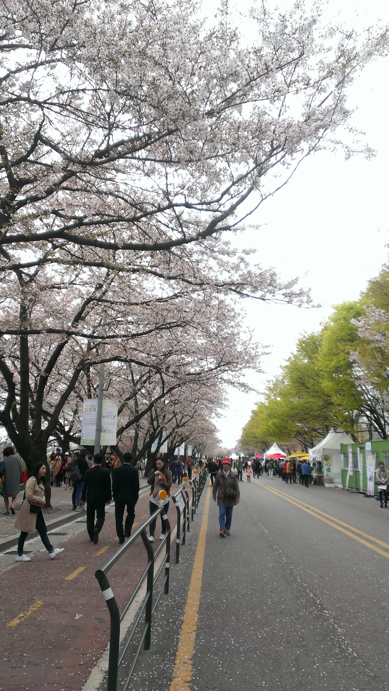
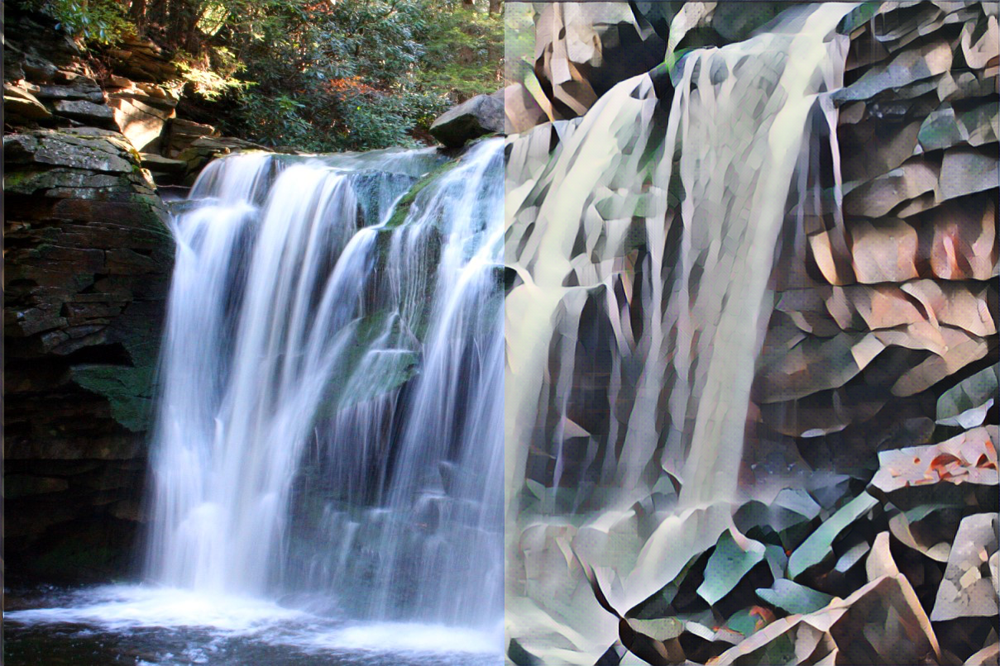
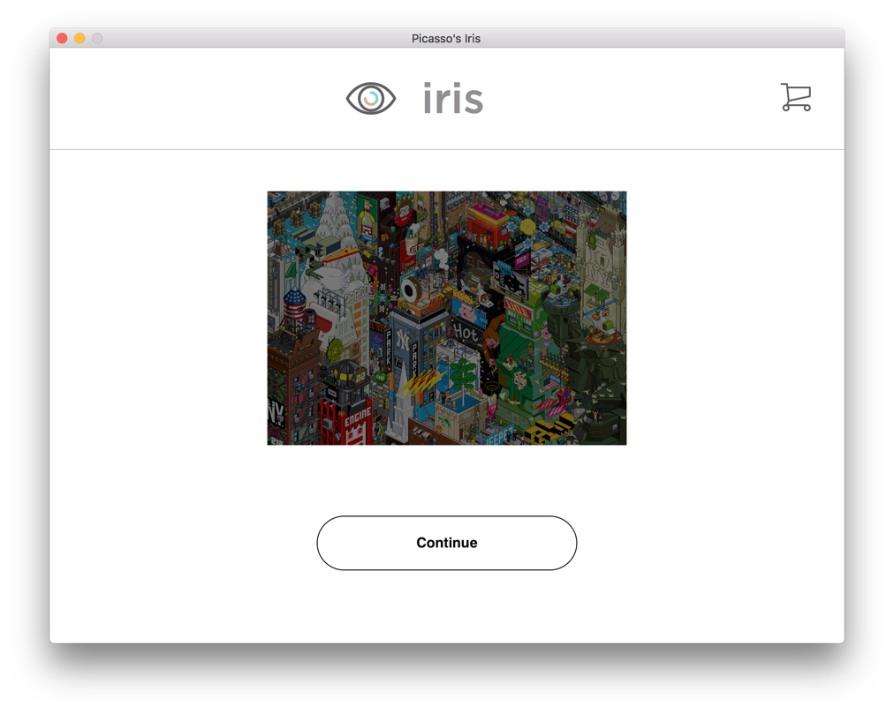
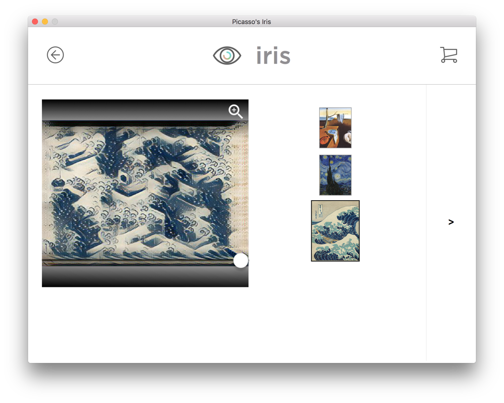
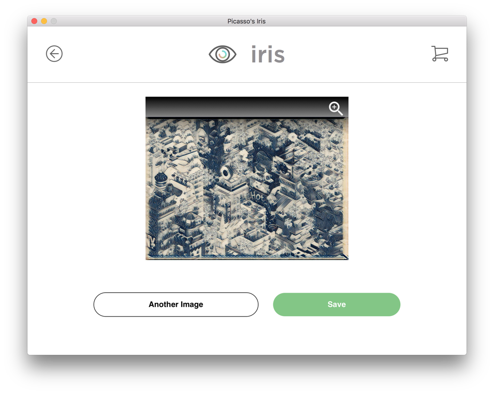

## Program Overview
This program is a tensorflow version of the "[A Neural Algorithm of Artistic Style](https://arxiv.org/pdf/1508.06576)" paper. An intuitive and user friendly GUI overlays the neural network to allow the results of this research to be explored by all.

## Architecture Overview
The network architecture consists of two convolutional neural networks. The larger of the two networks is called the compare_net. This network is the VGG-19 network and is used to compare the style and content image to the stylized image in order to determine the loss for the network that is doing the styling. the compare_net network is not trained and uses pretrained weights. As mentioned, there is a network that does styling. This network is called transform_net as the network transforms the provided content image into a stylized version of the content image using the selected style. The transform_net is trained using the loss calculated by the compare_net in order to produce a stylized image that is optimized for both the style and content of the images. In other words it produces a nicely styled image.

## Examples

## Flower:
 
 


## Cherry Blossoms
 


## Waterfall


## GUI




## Team Members
- [Adam Balint](https://github.com/AdamBalint)
- [Fahad Ahmad](https://github.com/fzxt)
- [Alex vanKooten](https://github.com/otherwise-six)
- [Justin McCarthy](https://github.com/justcarthy)
- [Vincent Morsaint](https://github.com/VMorsaint)

## Software Requirements
- Python 3.5+
- Node.js 5.0+

## Hardware  Requirements
- Intel® Core 2 or AMD Athlon® 64 processor; 2 GHz or faster processor
- Windows 7, 8, or 10 or macOS
- 8 GB of RAM 

## [Releases](https://github.com/AdamBalint/Picassos-Iris/releases)
- See the releases tab for macOS and Windows releases

## How to build locally

### 1. Install dependencies
Depending on your OS, enter the following commands in your terminal once in the project directory.

#### On macOS
```sh
$ pip install -r requirements.txt
$ pip install -r requirements.osx.txt
$ cd gui && npm install
$ npm run build
```

#### On Windows
```sh
$ pip install -r requirements.txt
$ pip install -r requirements.windows.txt
$ cd gui && npm install
$ npm run build
```

### 2. Run the application locally
```sh
$ cd src/backend && python3 main.py
```

## [Wiki for development](https://github.com/AdamBalint/Picassos-Iris/wiki)
